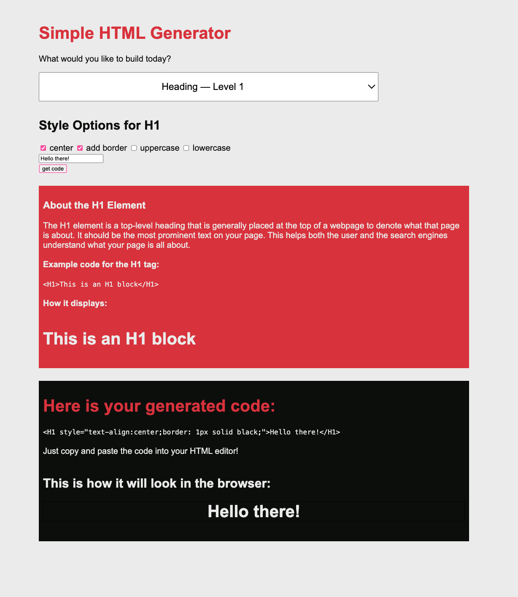

# Simple HTML Generator
This is a front-end JavaScript app that automatically generates HTML code and CSS for users to copy and paste into their IDE or HTML editor.
## Features
* Inputs for custom content
* Dropdown to select HTML element
* Checkboxes that allows users to customize CSS
* Outputs code and shows how the code will display in the browser
## Screenshot
